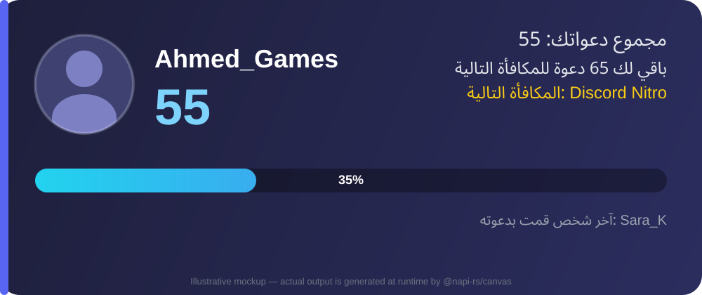
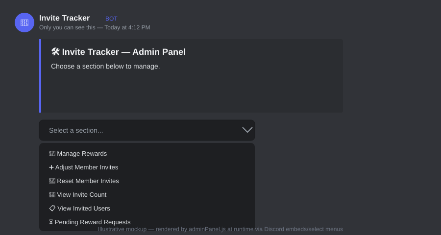
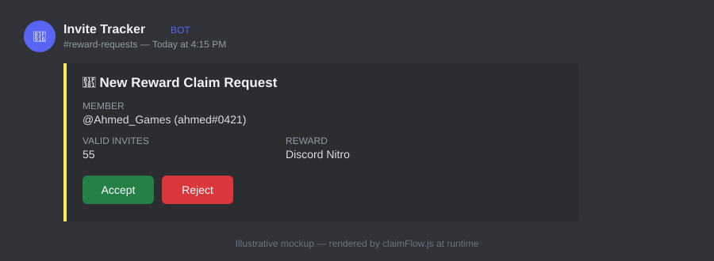
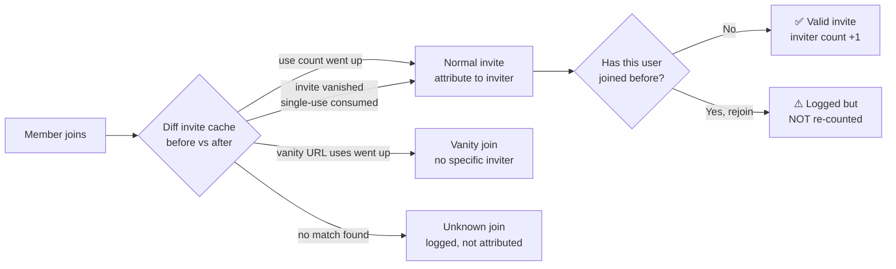
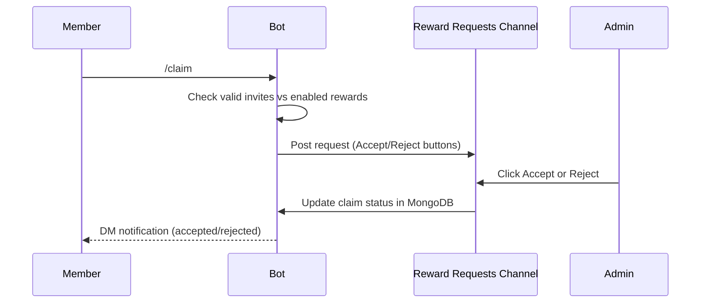

<div align="center">

# 🎉 Discord Invite Tracker + Rewards Bot

**Accurately tracks who invited each member, generates beautiful progress-card images, and lets admins run a fully dynamic rewards program — no code changes, ever.**

[](https://nodejs.org)
[](https://discord.js.org)
[](https://www.mongodb.com)
[](https://pm2.keymetrics.io)
[](#license)

</div>

---

## Preview

<table>
<tr>
<td align="center" width="60%"><strong><code>/invites</code> progress card</strong><br/><sub>generated PNG, Arabic + Latin text, updates live</sub></td>
<td align="center" width="40%"><strong><code>/admin</code> control panel</strong><br/><sub>select-menu driven, fully interactive</sub></td>
</tr>
<tr>
<td></td>
<td></td>
</tr>
</table>

<p align="center">

</p>

> The images above are illustrative mockups of the actual runtime output (built to match `imageGenerator.js` and `adminPanel.js` pixel-for-pixel), not static assets — every real card and panel is generated live from live data. Swap in real screenshots from your own server any time by replacing the files in `docs/images/`.

---

## Table of Contents

- [Features](#features)
- [Tech Stack](#tech-stack)
- [How It Works](#how-it-works)
- [Prerequisites](#prerequisites)
- [Discord Application Setup](#discord-application-setup)
- [Local Development](#local-development)
- [Production Deployment with PM2](#production-deployment-with-pm2)
- [First-time Configuration](#first-time-configuration)
- [Commands](#commands)
- [Project Structure](#project-structure)
- [Database Models](#database-models)
- [Troubleshooting](#troubleshooting)

---

## Features

- 🎯 **Accurate invite tracking** — detects the inviter by diffing the guild's invite cache before/after each join. Handles normal invites, vanity URLs, unknown/deleted invite codes, leaves, and rejoins (a rejoin is never double-counted as a new valid invite).
- 🖼️ **`/invites` progress card** — a generated PNG image with avatar, total valid invites, progress bar, next reward, and Arabic-language labels (Noto Sans Arabic, fully offline — no external image APIs).
- 🎁 **Fully dynamic rewards** — created, edited, enabled/disabled, and deleted entirely from Discord. Nothing is hardcoded.
- ✅ **Claim flow** — `/claim` posts a request with Accept/Reject buttons to a configurable channel; accepting/rejecting notifies the member by DM.
- 🛠️ **`/admin` control panel** — a single interactive command (select menus, buttons, modals) for reward CRUD, manual invite adjustments, resets, lookups, pending/claimed history, and channel/role configuration.
- 🏆 **`/leaderboard`** — top inviters, ranked.
- 🧾 **Full logging** — every important action is written to a configurable logs channel.
- 🌐 **Multi-guild support** — everything is scoped by `guildId`.

## Tech Stack

| | |
|---|---|
| Runtime | Node.js 20+, ES Modules |
| Discord | discord.js v14 |
| Database | MongoDB + Mongoose |
| Images | @napi-rs/canvas (offline, no external APIs) |
| Process manager | PM2 |

## How It Works

**Invite attribution**, on every `guildMemberAdd`:



**Reward claim flow**, from `/claim` to resolution:



---

## Prerequisites

- Node.js 20 or newer (`node -v` to check)
- A MongoDB database — either running locally, or a free
  [MongoDB Atlas](https://www.mongodb.com/atlas) cluster
- Access to the [Discord Developer Portal](https://discord.com/developers/applications)

---

## Discord Application Setup

1. Go to the [Discord Developer Portal](https://discord.com/developers/applications)
   and click **New Application**.
2. Open the **Bot** tab → **Add Bot**.
3. Under **Privileged Gateway Intents**, enable:
   - **Server Members Intent** (required — this is how the bot detects
     joins/leaves for invite tracking)
4. Copy the **Bot Token** (you'll need it for `.env`) and the **Application
   (Client) ID** from the **General Information** tab.
5. Go to **OAuth2 → URL Generator**:
   - Scopes: `bot`, `applications.commands`
   - Bot Permissions: `Manage Server`, `View Channels`, `Send Messages`,
     `Embed Links`, `Attach Files`, `Use Application Commands`,
     `Read Message History`
6. Open the generated URL and invite the bot to your server.

> **Why "Manage Server"?** The bot needs it to call `guild.invites.fetch()`
> and read vanity URL data — both required for accurate invite detection.

---

## Local Development

1. Clone / download this project.
2. Install dependencies:
   ```bash
   npm install
   ```
3. Copy the environment template and fill in your values:
   ```bash
   cp .env.example .env
   ```
   ```
   DISCORD_TOKEN=your-bot-token
   CLIENT_ID=your-application-id
   GUILD_ID=your-test-server-id   # optional but recommended for dev — instant command registration
   MONGODB_URI=mongodb://127.0.0.1:27017/invite-tracker
   ```
4. Add the Arabic/Latin fonts (see **Fonts** below) — required for correct
   `/invites` image rendering.
5. Register the slash commands:
   ```bash
   npm run deploy
   ```
6. Start the bot:
   ```bash
   npm start
   ```
   or, for auto-restart on file changes during development:
   ```bash
   npm run dev
   ```

### Fonts

`/invites` renders Arabic text, so the card needs a font that supports
Arabic shaping. Binary font files aren't included in this deliverable —
download them once (free, from Google Fonts) and drop them into
`assets/fonts/`:

- `NotoSansArabic-Regular.ttf`, `NotoSansArabic-Bold.ttf` — from
  https://fonts.google.com/noto/specimen/Noto+Sans+Arabic
- `NotoSans-Regular.ttf`, `NotoSans-Bold.ttf` — from
  https://fonts.google.com/noto/specimen/Noto+Sans

See `assets/fonts/README.md` for exact filenames. The bot still runs
without them (falls back to a system font with a console warning), but
Arabic text may not shape correctly until they're added.

---

## Production Deployment with PM2

1. Install PM2 globally if you haven't already:
   ```bash
   npm install -g pm2
   ```
2. Make sure `.env` is filled in and commands are deployed (`npm run deploy`),
   then start the bot under PM2:
   ```bash
   pm2 start ecosystem.config.cjs
   ```
3. Persist the process list so PM2 remembers it across reboots:
   ```bash
   pm2 save
   ```
4. Generate and run the startup script so PM2 (and your bot) restart
   automatically on server reboot:
   ```bash
   pm2 startup
   ```
   PM2 will print a command tailored to your OS/init system — copy, paste,
   and run it as instructed.

Useful PM2 commands:
```bash
pm2 status                    # see if it's running
pm2 logs discord-invite-bot   # tail logs
pm2 restart discord-invite-bot
pm2 stop discord-invite-bot
```

Logs also stream to `logs/out.log` and `logs/error.log` (configured in
`ecosystem.config.cjs`).

> If you deployed commands with `GUILD_ID` set (guild-scoped, for
> development), remove `GUILD_ID` from `.env` and run `npm run deploy` again
> before going live, so commands register globally across every server the
> bot is in.

---

## First-time Configuration

Once the bot is online in your server, an Administrator (or the server
owner) runs `/admin` and, from the panel:

1. **Set the Reward Requests channel** — where `/claim` requests are posted
   with Accept/Reject buttons.
2. **Set the Logs channel** — where every tracked action is logged.
3. **Set Admin Roles** — which roles (beyond Administrators/owner) can use
   `/admin`.
4. **Manage Rewards → Add Reward** — create your first reward(s), e.g.
   "Discord Nitro" at 5 invites.

Members can now run `/invites` to see their progress card, and `/claim` once
they qualify for a reward.

---

## Commands

| Command | Description |
|---|---|
| `/invites [user]` | Generates a progress-card image for yourself or another member. |
| `/leaderboard` | Shows the top inviters in the server. |
| `/claim` | Requests a reward you currently qualify for (opens a picker if you qualify for more than one). |
| `/admin` | Opens the interactive admin control panel (role-restricted). |

---

## Project Structure

```
/
├── src/
│   ├── index.js                 # bootstrap: connects DB, loads commands/events, logs in
│   ├── client.js                # Discord.Client factory (intents, collections)
│   ├── config.js                # env var loading/validation
│   ├── deploy-commands.js       # registers slash commands
│   ├── database/
│   │   ├── connection.js
│   │   └── models/              # GuildConfig, Invite, UserInvites, Reward, RewardClaim
│   ├── commands/                # /invites, /leaderboard, /claim, /admin
│   ├── events/                  # ready, guildMemberAdd/Remove, inviteCreate/Delete, interactionCreate
│   ├── handlers/                # command/button/select-menu/modal routers + admin panel + claim flow
│   ├── services/                # inviteTracker.js, imageGenerator.js, rewardService.js
│   └── utils/                   # logger.js, permissions.js
├── assets/fonts/                # Arabic + Latin .ttf files (see Fonts section)
├── docs/images/                 # README preview images
├── .env.example
├── package.json
├── ecosystem.config.cjs
└── README.md
```

---

## Database Models

- **GuildConfig** — `guildId`, `rewardRequestsChannelId`, `logsChannelId`, `adminRoleIds`
- **Invite** — full permanent history: `guildId`, `inviterId`, `invitedUserId`,
  `inviteCode`, `joinType`, `joinedAt`, `leftAt`, `isValid`
- **UserInvites** — live cache: `guildId`, `userId`, `validInviteCount`,
  `manualAdjustment`, `invitedUserIds[]`, `lastInvitedUserId`
- **Reward** — `guildId`, `name`, `requiredInvites`, `enabled`
- **RewardClaim** — `guildId`, `userId`, `rewardId`, `rewardName`,
  `requiredInvitesSnapshot`, `validInvitesAtRequest`, `status`, `requestedAt`,
  `resolvedAt`, `resolvedBy`, `rejectionReason`

---

## Troubleshooting

### Invite cache problems / wrong inviter detected
- Confirm the bot has the **Manage Server** permission — without it,
  `guild.invites.fetch()` fails silently and joins are logged as
  "unresolved invite" (`joinType: unknown`, `inviterId: null`).
- Confirm **Server Members Intent** is enabled in the Developer Portal
  *and* in the code (`GatewayIntentBits.GuildMembers` in `src/client.js`) —
  without it, `guildMemberAdd`/`guildMemberRemove` never fire.
- A single-use invite is deleted by Discord the instant it's consumed; the
  tracker handles this (see `detectUsedInvite` in `inviteTracker.js`, "Case
  2"), but if the bot was offline at the exact moment of the join, that
  invite's cache entry will be gone before the bot can diff it, and the
  join will fall back to "unresolved."
- Restarting the bot forces a fresh `cacheGuildInvites()` on `ready` — this
  is normal and expected; it does not affect already-stored history.

### Arabic font not loading / boxes (□) instead of Arabic text
- Make sure the four `.ttf` files are actually present in `assets/fonts/`
  with the **exact filenames** listed in `assets/fonts/README.md`.
- Check the console on startup for `[ImageGenerator] Font file not found`
  warnings — they name the missing file.
- Some minimal Linux server images lack any system fallback fonts at all;
  installing the bundled fonts (rather than relying on a system font)
  avoids this entirely, which is why they're required rather than optional.

### MongoDB connection issues
- Verify `MONGODB_URI` is correct and reachable from the machine running the
  bot (`mongosh "your-uri"` is a quick way to test).
- For MongoDB Atlas: make sure your server's IP is allow-listed under
  **Network Access**, and that the database user's password doesn't contain
  characters that need URL-encoding.
- The bot logs `[MongoDB] Connection error:` with the underlying driver
  error — that message almost always identifies the exact problem (auth
  failure, network timeout, bad hostname, etc.).

### Commands not appearing in Discord
- Did you run `npm run deploy`? Commands must be explicitly registered —
  starting the bot does not do this automatically.
- With `GUILD_ID` set in `.env`, commands register instantly to that one
  server — confirm you're testing in the right server.
- Without `GUILD_ID` (global registration), Discord can take **up to an
  hour** to propagate new/changed commands to all servers.
- Try fully restarting your Discord client (Ctrl/Cmd+R or relaunch) — the
  client caches the command list.

---

## License

Released under the [MIT License](LICENSE) — free to use, modify, and self-host.

---

<div align="center">
<sub>Built with discord.js, Mongoose, and @napi-rs/canvas.</sub>
</div>
